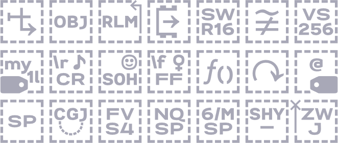

# Ctrl
基于[2021年7月18日的投票结果](https://t.bilibili.com/548801038367849128?tab=2)，我的完全原创字体家族现以“尺规 | Ctrl”为姓。

Ctrl（control，寓意尺规作图）系列包含几个风格不同的字族。由于使用共通的字重和度量，这些字族任意混排仍能协调，也与雅黑等系统中文字体搭配。

<!-- **〔字体可在[/Releases](https://github.com/MY1L/Ctrl/releases)搜索下载〕** -->
<h3 align="center"><a href="https://github.com/MY1L/Ctrl/releases">〔字体可在 /Releases 搜索下载〕</a></h3>

----

包含如下字族，目前有无衬线和像素风格。可点击本页上方不远处的菜单按钮（形如三点三横的）快速跳转。

## Ctrl

**尺规图符**。名称取自 ~~唱、跳、rap、篮球 的缩写~~ 控制符([Controls](https://github.com/MY1L/Unicode/tree/main/Blocks))的[缩写](https://github.com/MY1L/Unicode/tree/main/abbr)，嗯，与本系列自身重名了。

一个完全原创的工具字体，作用类似控制图符 (**Control** Pictures)，用于让那些统一码规定没有字形的 控制字 (**Control** Character)、变体选择符 (Variation Selectors)、格式控制符 (Format **Controls**)、空格 (space等零宽非打印字符)、标签 (Tag) 等尽量显示**替代图符**以便发现、选择、复制。其字形形如[Monu Last][MonUni]的区段范例字形和[Monu Hani]的表意描述符。
- 作为我的原创，其中西文字形改造了我在2021年设计的字宽可变字体，下方[Ordn](#ordn)有详述。
- 什锦符号也继承我过去绘制的[绘文字字形](#zsye)。不过为搭配Ordn，凡圆形部分都改为超椭圆风格。
- 顺带一提这些图符都是手动拼字，不是批量生成：试过批量会没法控制字距`kern`，比如`74`会显得间隔很远。
- 它支持的字符远不止[Unicode/FontList.csv](https://github.com/MY1L/Unicode/blob/main/FontList/FontList.csv)列出的那些，其它统一码中规定非打印或无字形的特定字符也有。
- 注意，这是个有专门用途的工具，可能会干扰日常使用——你应该不会希望网页上每个空格都是可见的吧？

未来计划：
- 继续补充统一码中无字形字符的替代图符。
- 将没必要完全原创的字形另外发布为“典迹图符 | Monu Ctrl”。
- 或另发布一个ASCII字形都替换成标签的字体“尺规图签 | Ctrl Tags”。

## Ding
**尺规行标**。规整的工业风窄体，用于限定字高的场合下展现更多信息。名称取自DIN和Dingbats。
- 该字体创作理念借鉴可以尺规绘制的德国DIN1451，因为当时没看到免费的类DIN字体，所以原创了个。
- 与DIN不同的是考虑了曲率连续。

未来计划：做成字重和字宽可变。添加苏州码子等数字字符、SMP平面的字符（以DIN的风格呈现），和一些Dingbats。

## Kana
**尺规假名**。因为Noto、思源都不含假名扩充乙（`1AFF0..`Kana Extended-B：𚿰𚿱𚿲𚿳𚿵𚿶𚿷𚿸𚿹𚿺𚿻𚿽𚿾），我原创了一套。
- 其中实心点相对空心点有视觉处理。
- 已被用于[Monu Hani]。还包含其它一些我绘制的假名字形。

## Latf
**尺规哥特**。名称取自[ISO 15924]里拉丁德文尖角体(Latin (Fraktur variant))的四字代码。
- 无衬线风格的𝔉𝔯𝔞𝔨𝔱𝔲𝔯.
- 出于数学字母数字符号区段的兼用考虑。

未来计划：做成字重可变。

## Math
**尺规计数**。目前只含卡克托维克数字（`1D2C0..`Kaktovik Numerals：𝋀𝋁𝋂𝋃𝋄𝋅𝋆𝋇𝋈𝋉𝋊𝋋𝋌𝋍𝋎𝋏𝋐𝋑𝋒𝋓）
- 从字形易知为何它是20进制。做这字体，“油墨陷阱”(避免笔画交叉处过黑)是必要的。
- 经验：数字2不能做成V，4不能做成W，应当如统一码范例那样不对称，否则7 9 12 14 17 19会显得难看。
- 已被用于[Noto Unicode][MonUni]。

## [Mono][abbr]
**尺规等宽**。

未来计划：或将[Ding](#ding)改为编程用等宽形式。考虑实用性，可能只做一般代码编辑器会用到的 常规、粗体、意大利体。为了与系统中文字体搭配，只有半角或半角倍数的宽度。

## Ordn

**尺规列序**。用于序数（ordinal，OpenType序数特性）及竖排全角用的可变字体。
- 字形是比较胖的超椭圆风格。可见Ｂ站专栏：[CtrlOrdn：超椭圆风竖排用可变字体，及ꓡꓲ-ꓢꓴ老傈僳文](https://www.bilibili.com/read/cv12807979)
- 出于混排考虑，度量、字重均与雅黑的汉字相当，实例对应雅黑的字重（常规、粗体）可[查表][abbr]。
- 有`１０`连字（需开启OT特性`ordn`），该连字与单个全角数字等宽，用于排行榜等。
- 支持这些OT特性：`aalt` `calt` `case` `ccmp` `fwid` `kern` `liga` `mark` `ordn` `pnum` `pwid` `salt` `ss01` `tnum` `vert` `zero`（注：由于默认斜杠〇，开启`zero`反而去除斜杠），支持变体选择符。
- 有字重和字宽2个可变轴。为方便不支持可变字体的软件，也做了通常的字体族实例。
- 因竖排用途，字宽可变的字形基本仅适用大写（其中全角的字身框始终保持全角不变）
- 许多小写英文(ASCII)部分用小型大写凑数。支持大量的小型大写字符。
- 2021-8-18：**支持老傈僳文（包含完整的傈僳、傈僳补充区段）**

未来计划：补充一些拉丁、希腊、西里尔大写字母，考虑添加`clig`，改进`mark` `vert`，甚至`mkmk` `vrt2` `vrtr`。话说全角小写英文有可能做得美观吗……

或不打算支持的特性：
- `hwid` 该字体风格不适合半角；`twid`⅓em宽、`qwid`¼em宽更不可能了。
- `onum` 该字体风格不适合Oldstyle数字。
- `smcp` `pcap` 设计上几乎已经是small-caps＼petite caps，除了'p'、'q'
- `c2pc` `c2sc` 同上，也会导致无法区分大小写。
- `titl` 基本已是按titling-caps设计。
- `unic` Unicase，“大型小写”、“大小写不分”体。

## Poop

**[噗叽体](https://github.com/MY1L/FontGame#噗叽--poop)**。这是个字重可变宽体圆体，下载不在这儿，请点前方链接。\
之所以没取名“尺规噗叽”，是因为这个中文字体缺“尺规”二字，很💩。

视频预览：[｢为𠷡镀金，画蛇添足｣ 开源免费，可变字体“噗叽｜Poop”发布\_哔哩哔哩](https://www.bilibili.com/video/BV1QY4y1U7bd/)

## Runr

**尺规如尼**。名称取自[ISO 15924]里卢恩(Runic)的四字代码。
- 出于更美观的如尼\卢恩文字无衬线体需求而作。可见ᛒ站专栏：[CtrlRunr：蓝牙ᚼᛒ・卢恩符文・魔戒文字黑体试作](https://www.bilibili.com/read/cv12887381)
- 出于混排考虑，度量、字重均与雅黑常规相当。包含卢恩符文、魔戒奇尔斯(Cirth)——因两者字形雷同，可合并复用以节省文件体积。
- 有`ᚼᛒ`蓝牙图标连字（需软件支持OT特性`ccmp`，浏览器应该默认开启。为免混乱，正式版改为仅可用zwj※连字：`ᚼ‍ᛒ`）
- 支持奇尔斯的统一码(SMP预留区段)和CSUR码双重显示，例如“CIRTH LETTER UI”	𖀮U+1602E（csurU+E0AE），但请注意**目前客观上魔戒编码还不确定，将来可能会变化**。
- 2021-8-28：**包含全部108个奇尔斯×双重编码**及相关的结合变音标记（[2001版](https://www.evertype.com/standards/iso10646/pdf/cirth.pdf)）
- 2021-8-31：**包含全部89个卢恩**及调整了所有字符的度量和`kern`，添加奇尔斯zwj连字`𖀞‍𖀞`，测试支持`mark`特性。至此基本完成。

> 注※：`U+200D ZERO WIDTH JOINER`简称ZWJ，是个零宽隐形的字符，用于指示其前后2个字符应当连字（需字体作相应支持），由于宽度为〇难以选中复制，为方便起见，上文凡写明“zwj连字”的2个字符中间都已经夹了个ZWJ。\
你可以试试在某些软件中将字体设为[Ctrl Ctrl](#ctrl)来显示它。

## Seal
**尺规说文**。说文部首（王福庵风格）小篆黑体，或含[Monu Hani]的原创部分。

未来计划：做成字重可变。[已有实例。](https://twitter.com/MY1Ltype/status/1637031145476100098)

## Tang
**尺规西夏**。名称取自[ISO 15924]里西夏(Tangut)的四字代码。
- 这是个设计为与雅黑等系统字体风格搭配的原创西夏文黑体，字形原公开在我的字体[MonuLast](https://github.com/MY1L/Unicode)中，现分离出来，添加字符（𗄴𗼇𘠈𘠐𘢌𘤩𘴀等）并修正。
- 因为缺乏时间人手的关系，该字体为协作形式，字体文件中的笔画已拆分方便大家参与制作，且有做可变偏旁的计划，欢迎相关文字爱好者来Q群聊：`879413445`

## Zpix

**尺规点阵**。目的在搭配[SolidZORO/Zpix(最像素)](https://github.com/SolidZORO/zpix-pixel-font)汉字的西文像素字体。
- 介绍详见b站专栏：[给像素字体加上高级排版特性：Ctrl Zpix介绍](https://www.bilibili.com/read/cv16072622)
- 2022-4-10：初发布，作高级排版特性演示。
- 2022-4-20：更新第3.1版，基本完成。

## Zsye
**尺规彩绘**。名称取自[ISO 15924]里绘文字(Symbols (Emoji variant))的四字代码。
- 彩色字体，为了更美观地显示绘文字而作。可见🅱️站专栏：[自制彩色字体Zsye发布・绘文字的隐藏技](https://www.bilibili.com/read/cv11706229)
- 曾名“Monu Zsye”与Monu系列搭配，但实际该字体为完全原创，遂迁来Ctrl系列。
- [在线预览和测试Zsye（Monu旧版）](https://my1l.github.io/wwwoff/)

~~未来计划：拆分旗帜绘文字为新字体“Flag”，考虑到做旗帜工程量过大，应该会借用他人资源难以完全原创，~~ 不归Ctrl系列。目前如需要在视窗上显示旗帜绘文字，请至[MY1L/Plur](https://github.com/MY1L/Plur/releases)

## ????
- Ding是窄体，Ordn是中到宽体，也许需要制作字宽介乎两者之间适合系统用的“未来”体，西文名称征集中……
- 甲骨文（[Orcl](https://github.com/MY1L/Unicode/tree/main/abbr#已有实例以及我编的)）或其它古文黑体，即[Monu Hani]的原创部分。
- 藏文黑体，Zang（行政区缩写）＼Tibt（[ISO 15924]里藏文(Tibetan)的四字代码）
- ……

[Monu Hani]: https://github.com/MY1L/Unicode/tree/main/Hani
[ISO 15924]: https://github.com/MY1L/Unicode/tree/main/abbr
[MonUni]: https://github.com/MY1L/Unicode
[abbr]: https://github.com/MY1L/Ctrl/blob/main/abbr.md

----

我其它原创字体如[女书柳叶](https://github.com/MY1L/Nyushu)和[曺全碑隸](https://github.com/MY1L/CoQuBeLi)，由于是衬线风格，不放在这。