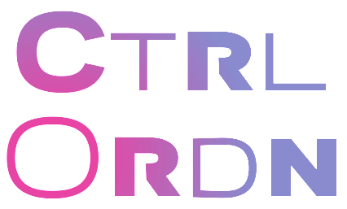

# Ctrl
基于[2021年7月18日的投票结果](https://t.bilibili.com/548801038367849128?tab=2)，我的完全原创字体家族现以“Ctrl”为姓。

Ctrl（control，寓意尺规作图）系列包含几个风格不同的字族。由于使用共通的字重和度量，这些字族任意混排仍能协调，也与雅黑等系统中文字体搭配。

**〔字体可在[/Releases](https://github.com/MY1L/Ctrl/releases)下载〕**

----

包含如下字族，目前都是无衬线风格（不排除将来做衬线体）

## Ding
规整的工业风窄体，用于限定字高的场合下展现更多信息。名称取自DIN和Dingbats。
- 该字体创作理念借鉴可以尺规绘制的德国DIN1451，因为没有免费的DIN字体，所以原创了个。
- 与DIN不同的是考虑了曲率连续。

未来计划：做成字重和字宽可变。添加苏州码子等数字字符、SMP平面的字符（以DIN的风格呈现），和一些Dingbats。

## [Mono](https://github.com/MY1L/Ctrl/blob/main/abbr.md)
未来计划：[Ding](#ding)改为编程用等宽形式。考虑实用性，可能只做一般代码编辑器会用到的 常规、粗体、意大利体。为了与系统中文字体搭配，只有半角或半角倍数的宽度。

## Ordn

用于序数（ordinal，OpenType序数特性）及竖排全角用的可变字体。
- 字形是比较胖的超椭圆风格。可见Ｂ站专栏：[CtrlOrdn：超椭圆风竖排用可变字体，及ꓡꓲ-ꓢꓴ老傈僳文](https://www.bilibili.com/read/cv12807979)
- 出于混排考虑，度量、字重均与雅黑的汉字相当，实例对应雅黑的字重（常规、粗体）可[查表](https://github.com/MY1L/Ctrl/blob/main/abbr.md)。
- 有`１０`连字（需开启OT特性`ordn`），该连字与单个全角数字等宽，用于排行榜等。
- 支持这些OT特性：`aalt` `calt` `case` `ccmp` `fwid` `kern` `liga` `mark` `ordn` `pnum` `pwid` `salt` `ss01` `tnum` `vert` `zero`（注：由于默认斜杠〇，开启`zero`反而去除斜杠），支持变体选择符。
- 有字重和字宽2个轴。为方便不支持可变字体的软件，也做了通常的字体族实例。
- 因竖排用途，字宽可变的字形基本仅适用大写（其中全角的字身框始终保持全角不变）
- 许多小写英文(ASCII)部分用小型大写凑数。支持大量的小型大写字符。
- 2021-8-18：**支持老傈僳文（包含完整的傈僳、傈僳补充区段）**

未来计划：补充一些拉丁、希腊、西里尔大写字母，考虑添加`clig`，改进`mark` `vert`，甚至`mkmk` `vrt2` `vrtr`。话说全角小写英文有可能做得美观吗……

不打算支持的特性：
- `hwid`该字体风格不适合半角；`twid`⅓em宽、`qwid`¼em宽更不可能了。
- `onum`该字体风格不适合Oldstyle数字。
- `smcp` `pcap`设计上几乎已经是small-caps＼petite caps，除了'p'、'q'
- `c2pc` `c2sc` 同上，也会导致无法区分大小写。
- `titl`基本已经是按titling-caps设计。
- `unic`大型小写？

## Runr

名称取自[ISO 15924](https://github.com/MY1L/Unicode/tree/main/abbr)里卢恩(Runic)的四字代码。
- 出于更美观的无衬线体如尼\卢恩文字需求。可见ᛒ站专栏：[CtrlRunr：蓝牙ᚼᛒ・卢恩符文・魔戒文字黑体试作](https://www.bilibili.com/read/cv12886437)
- 出于混排考虑，度量、字重均与雅黑常规相当。包含ᚼᚾᚿᛁᛅᛆᛒᛖᛗᛡᛥ等字。
- 有`ᚼᛒ`蓝牙图标连字（需支持OT特性`ccmp`，浏览器应该默认开启）
- 测试性地包含奇尔斯(Cirth)“CIRTH LETTER UI”	𖀮U+1602E（csurU+E0AE）

未来计划：如果有人对完全版Runr有需要，请告诉我！

## Tang
名称取自[ISO 15924](https://github.com/MY1L/Unicode/tree/main/abbr)里西夏文(Tangut)的四字代码。
- 这是个设计为与雅黑等系统字体风格搭配的原创西夏文黑体，字形原公开在我的字体[MonuLast](https://github.com/MY1L/Unicode)中，现分离出来，添加字符（𗄴𗼇𘠈𘠐𘢌𘤩𘴀等）并修正。
- 因为缺乏时间人手的关系，该字体为协作形式，字体文件中的笔画已拆分方便大家参与制作，且有做可变偏旁的计划，欢迎相关文字爱好者来群聊~

## ????
- Ding是窄体，Ordn是中到宽体，也许需要制作字宽介乎两者之间适合系统用的字体……
- 甲骨文（Orcl，暂用甲骨文公司的纳斯达克股票代码缩写）或其它古文黑体，即[MonuHani](https://github.com/MY1L/Unicode/releases)的完全原创部分。
- 藏文黑体，Zang（行政区缩写）＼Tibt（ISO 15924里藏文(Tibetan)的四字代码）
- 无衬线风格的𝔉𝔯𝔞𝔨𝔱𝔲𝔯。
- 某衬线风格的女书。
- ……